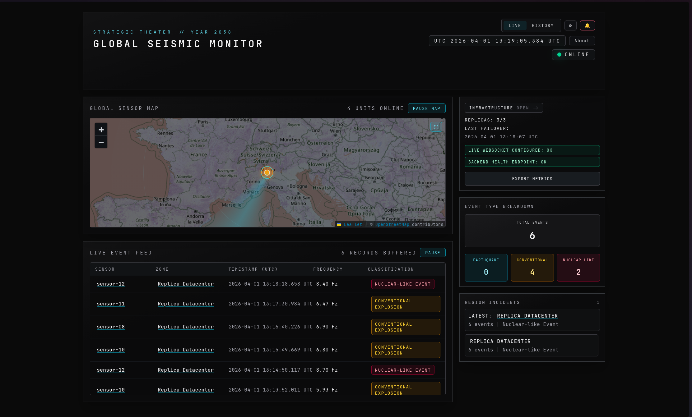
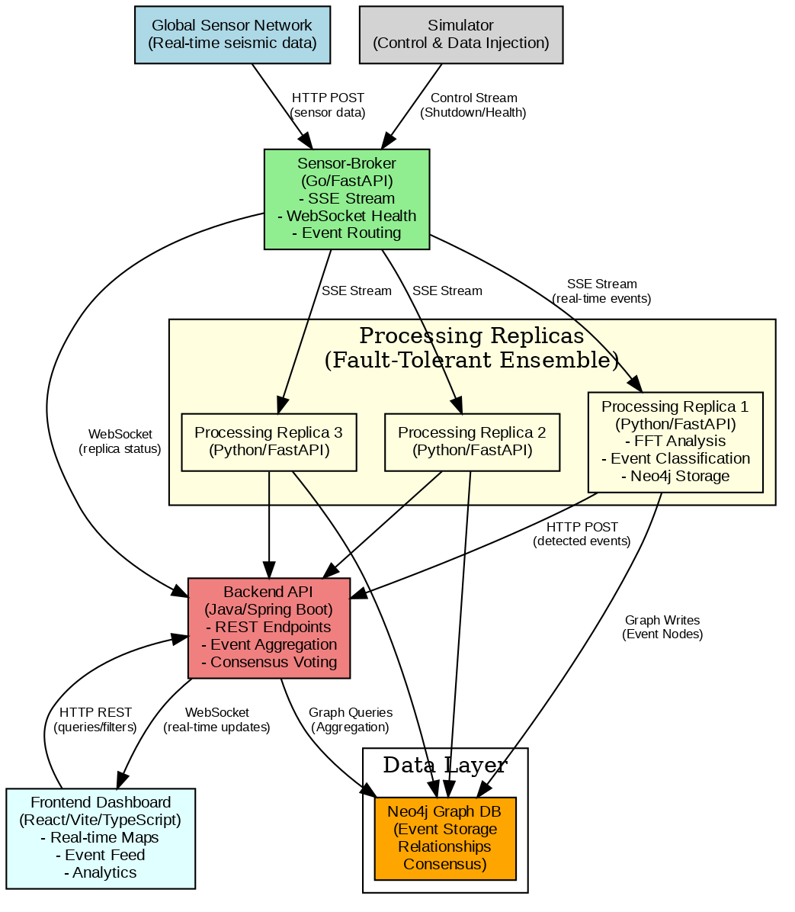

# A Fragile Balance of Power

**Team:** Gladiators — `1986173_Gladiators`

| Member | LinkedIn |
|---|---|
| Antonio Turco | [linkedin.com/in/antonyoturco](https://www.linkedin.com/in/antonyoturco/) |
| Simone Nolè | [linkedin.com/in/simone-nolè-306940400](https://www.linkedin.com/in/simone-nol%C3%A8-306940400) |
| Alfredo Segala | [linkedin.com/in/alfredo-segala-24ab89295](https://www.linkedin.com/in/alfredo-segala-24ab89295/) |
| Damiano Spadaccini | [linkedin.com/in/damiano-spadaccini-2890b323b](https://www.linkedin.com/in/damiano-spadaccini-2890b323b/) |

A distributed, fault-tolerant seismic monitoring platform that ingests real-time sensor data, classifies seismic events using FFT-based frequency analysis, and provides a live operational dashboard.

---

## Dashboard



---

## Architecture Overview



The system is composed of five containerized services that communicate over a shared Docker network:

| Container | Technology | Port | Role |
|---|---|---|---|
| **Simulator** | Provided image | `9090` | Seismic sensor data source |
| **Sensor-Broker** | Go | `8082` | Ingests sensor streams, fans out to replicas via SSE |
| **Processing-Replica** | Python / FastAPI | `8090` | FFT analysis, event classification, consensus voting |
| **Backend-API** | Java / Spring Boot | `8080` | Aggregated REST + WebSocket API for the frontend |
| **Frontend** | TypeScript / React | `3000` | Real-time monitoring dashboard |
| **Database** | Neo4j | `7687` | Persistent graph storage for events and replicas |

### Data Flow

```
Simulator → Sensor-Broker → Processing-Replicas (N) → Neo4j
                                                     ↘ Backend-API → Frontend
```

1. The Sensor-Broker subscribes to all sensor WebSocket streams from the simulator.
2. It validates and broadcasts measurements to all connected processing replicas via SSE.
3. Each replica maintains a sliding window per sensor, applies DFT/FFT, and classifies events.
4. Classified events are persisted to Neo4j with duplicate-safe (idempotent) writes.
5. Replicas also subscribe to the simulator's control stream and shut down on command.
6. The Backend-API queries Neo4j and exposes data to the frontend via REST and WebSocket.

### Event Classification

| Event Type | Frequency Range |
|---|---|
| EARTHQUAKE | 0.5 Hz ≤ f < 3.0 Hz |
| CONVENTIONAL_EXPLOSION | 3.0 Hz ≤ f < 8.0 Hz |
| NUCLEAR_EVENT | f ≥ 8.0 Hz |

---

## Prerequisites

- Docker and Docker Compose (v2)
- The simulator image loaded locally:

```bash
docker load -i seismic-signal-simulator-oci.tar
```

---

## Running the System

```bash
cd source
docker compose up
```

All services start automatically. No manual configuration is required after startup.

| Service | URL |
|---|---|
| Frontend Dashboard | http://localhost:3000 |
| Backend API | http://localhost:8080 |
| Sensor Broker | http://localhost:8082 |
| Simulator API / Swagger | http://localhost:9090/docs |
| Neo4j Browser | http://localhost:7474 |

### Simulator Controls (for testing)

Manually inject a seismic event on a sensor:

```bash
curl -X POST http://localhost:9090/api/admin/sensors/sensor-01/events \
  -H "Content-Type: application/json" \
  -d '{"event_type": "earthquake"}'
```

Manually trigger a replica shutdown:

```bash
curl -X POST http://localhost:9090/api/admin/shutdown
```

---

## Repository Structure

```
1986173_Gladiators/
├── input.md                  # System overview and user stories
├── student_doc.md            # Deployed system specification
├── architecture_overview.png # Architecture diagram
├── source/
│   ├── docker-compose.yml    # Root compose file (includes all services)
│   ├── broker/               # Sensor-Broker service (Go)
│   ├── replicas/             # Processing-Replica service (Python/FastAPI)
│   ├── backend/              # Backend-API service (Java/Spring Boot)
│   ├── frontend/             # Frontend webapp (TypeScript/React)
│   ├── db/                   # Database configuration (Neo4j)
│   └── bruno/                # API collection for manual testing
└── booklets/
    ├── assignment.md                          # Original assignment brief
    ├── API_CONTRACT.md                        # Simulator API contract
    ├── DOCKER_CONTRACT.md                     # Simulator Docker configuration
    ├── AFragileBalanceOfPower - Presentation.pdf
    └── AFragileBalanceOfPower - User Stories.pdf
```

---

## Booklets

The `booklets/` directory contains the project reference documents:

- **[assignment.md](booklets/assignment.md)** — Full assignment brief including requirements, constraints, and deliverables.
- **[API_CONTRACT.md](booklets/API_CONTRACT.md)** — Simulator HTTP/WebSocket/SSE API reference (endpoints, DTOs, behaviors).
- **[DOCKER_CONTRACT.md](booklets/DOCKER_CONTRACT.md)** — Simulator container environment variables and startup behavior.
- **[Presentation slides](booklets/AFragileBalanceOfPower%20-%20Presentation.pdf)** — Project presentation.
- **[User Stories booklet](booklets/AFragileBalanceOfPower%20-%20User%20Stories.pdf)** — Full user stories with LoFi mockups.

---

## Fault Tolerance

- The processing replica is the only component subject to failure (per assignment spec).
- Multiple replicas run in parallel; each subscribes independently to the broker SSE stream and the simulator control stream.
- When a replica receives `{"command":"SHUTDOWN"}` from the control stream, it terminates itself.
- The Backend-API uses health checks to detect unavailable replicas and routes requests only to healthy ones.
- Consensus voting across replicas prevents duplicate events from being persisted.
